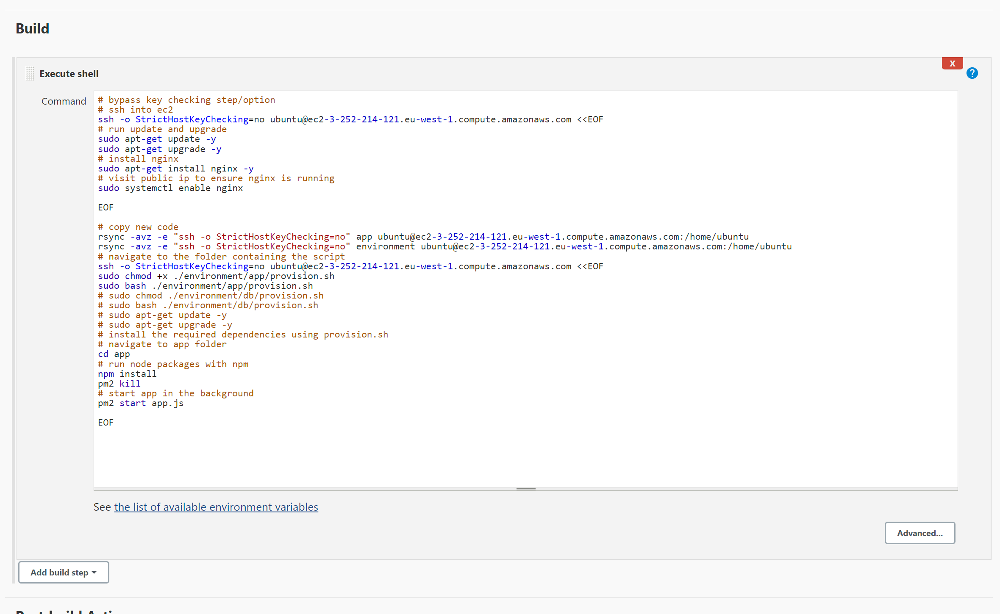
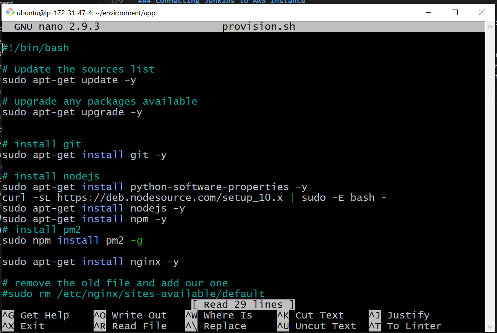

# CI/CD pipeline

- [CI/CD pipeline](#cicd-pipeline)
    - [What?](#what)
    - [Why?](#why)
    - [When?](#when)
    - [How?](#how)
    - [Delivery vs Deployment in production](#delivery-vs-deployment-in-production)
    - [Job Overview](#job-overview)
      - [Job 1: Testing Sparta App](#job-1-testing-sparta-app)
      - [Job 2: Merging dev branch and main branch IF Job 1 is successful.](#job-2-merging-dev-branch-and-main-branch-if-job-1-is-successful)
      - [Job 3: CD of deploying main branch to production.](#job-3-cd-of-deploying-main-branch-to-production)
      - [Job 4: Deploying the app with new code](#job-4-deploying-the-app-with-new-code)
    - [How to create a Jenkins project](#how-to-create-a-jenkins-project)
    - [Creating a Webhook for our Jenkins project](#creating-a-webhook-for-our-jenkins-project)
    - [Connecting Jenkins to AWS Instance](#connecting-jenkins-to-aws-instance)
    - [Deploying the app with new code](#deploying-the-app-with-new-code)

### What?
A CI/CD (Continuous Integration/Continuous Delivery) pipeline is a set of automated processes that help teams deliver software changes more frequently and reliably. It involves building, testing, and deploying code changes automatically. Here's a quick breakdown:
- Continuous Integration (CI): This part involves automatically building and testing code changes whenever a developer commits code to a shared repository. It helps identify issues early in the development process.
- Continuous Delivery (CD): This part focuses on automating the deployment of tested code to production or staging environments. The goal is to ensure that software can be released quickly, safely, and frequently.    
- Continuous Deployment takes CD one step further by automatically deploying every code change that passes through the CI/CD pipeline to production environments without manual intervention.

### Why?
Implementing a CI/CD pipeline offers several benefits:
- Faster Feedback: Developers receive immediate feedback on code changes, reducing integration issues.
- Consistency: Automated builds and tests ensure consistent quality across different environments.
- Reduced Risk: Automated deployments minimize human error, making releases more reliable and safer.
- Faster Time to Market: Streamlined processes enable quicker delivery of new features and bug fixes.    

### When?
A CI/CD pipeline is beneficial in any software development project, especially in scenarios where:
- Multiple developers are working on the same codebase.
- Rapid deployment of features and bug fixes is essential.
- Consistent and reliable builds are needed across different environments.
- Testing needs to be automated to ensure code quality.

### How?
Implementing a CI/CD pipeline involves several steps:
- Source Control Management: Use version control systems like Git to manage code changes.
- Automated Builds: Set up tools like Jenkins, Travis CI, or GitLab CI to automatically build your application whenever code changes are pushed.
- Automated Testing: Integrate unit tests, integration tests, and other automated tests into your pipeline to ensure code quality.
- Artifact Management: Store build artifacts in a repository like Nexus or Artifactory.
- Continuous Deployment: Automate the deployment process using tools like Kubernetes, Docker, or AWS Lambda to deploy applications to staging or production environments.
- Monitoring and Feedback: Integrate monitoring tools to track application performance and provide feedback to developers.
  

### Delivery vs Deployment in production
Delivery refers to the process of handing over the completed or tested software to the operations or production environment. It encompasses preparing the software for deployment and ensuring that it's packaged correctly.  
Deployment refers to the process of making the software available and operational in a specific environment, typically the production environment where end-users will access it.  
- Scope: Delivery focuses on preparing the software for deployment by creating a release package, while deployment focuses on actually installing and configuring the software in the production environment.
- Activities: Delivery involves packaging, versioning, and documenting the software, whereas deployment involves installation, configuration, and integration.
- Timing: Delivery usually precedes deployment. Delivery ensures that the software is ready to be deployed, whereas deployment turns the delivered software into a live and operational system.

In summary, delivery is about preparing the software for deployment, while deployment is about putting the software into operation in the production environment.
  

### Job Overview

This section will provide an overview of the jobs we are creating in the following section.
#### Job 1: Testing Sparta App
Here, we will be connecting our Github Repo to Jenkins, whilst running a test that our `npm install` functions as intended, in the `app` folder.
#### Job 2: Merging dev branch and main branch IF Job 1 is successful.
Once Job 1 has passed the tests and we know it functions as intended, we will merge the dev branch with the main branch, which ensures there are no conflicts and the merge only occurs IF Job 1 is successful.
#### Job 3: CD of deploying main branch to production.
Job 3 initiates the Continuous Deployment (CD) phase by deploying the code from the main branch to production. It will push the code to the production environment, typically an EC2 instance.
#### Job 4: Deploying the app with new code
Job 4 automates the deployment of the app, so that the app will begin running once the job has been executed.

### How to create a Jenkins project

A Jenkins project refers to a specific task or job configured within Jenkins, which is an open-source automation server used for continuous integration and continuous delivery (CI/CD) of software projects. 
 
By defining and managing projects in Jenkins, development teams can automate key aspects of their software delivery pipeline, ensuring efficiency, consistency, and reliability in the software development lifecycle.

1. Click on new item

2. Name your item and specify the project, in this situation we are using a `Freestyle project`.  
 

3. Provide a description of your item, this should allow other people to understand the reasoning of your item.
4. Click `GitHub project` and supply the URL of your GitHub project.
5. Click `Restrict where this project can be run` and specify `sparta-ubuntu-node` as this will protect the master branch.

6. Click `Git` for `Source Code Management`, specify the repository using the "SSH" link provided on Github. The `Branch` should also be `main`.

7. To access the GitHub repo, you must provide the private key. To do this, click on the `add` in the picture above, enter the contents of your private key.
8. We are leaving `Build Triggers` alone for now, but click `Provide Node & npm bin/folder to Path`.
9. For the `Build` box, click `execute shell` as this will be how we run our tests. Here, you must enter the following script:
   1.  `cd app`
   2.  `npm install`
   3.  `npm test` 
    
This will be how we conduct our tests, and what we are specifically testing.

### Creating a Webhook for our Jenkins project
A webhook is a mechanism that allows one system or application to notify another system or application about events or updates in real-time.

1. Navigate to the Github Settings and click Webhooks.
2. Click create new webhook.
3. Enter the url of your Jenkins page in `Payload URL`.
4. The `Content type` should be `application/json`.
5. Click `Let me select individual events` as we wish to be alerted to both push and pulls.

 

6. Next, we must navigate to Jenkins and configure our item to collaborate with the webhook.
7. Click the `GitHub hook trigger for GITScm polling` option and you are done! You have successfully created a Webhook for your Jenkins item.
   
   

### Connecting Jenkins to AWS Instance
1. Create a new item in your dashboard. 

2. Provide a description that will allow colleagues to understand the reasoning behind the job you are creating.
3. Provide a `max # of builds` of 3, as this will prevent the server from crashing if there is too much traffic.
4. Provide the GitHub project URL that you are using.
   
5. Provide the GitHub SSH URL provided as well as the private key that you have created beforehand. The branch we are working on will be `main`.
   
6. We are using `SSH Agent` and providing the private key required to access our instance. This is to allow our Jenkins project to SSH into our EC2 instance and run the shell commands we desire.
   
7. Now onto our Shell commands, the purpose of this project is to ultimately, start our app in the background. Before we can do this, we must SSH into our instance, then run the necessary update&&upgrade commands, as well as installing nginx. From there, we must enable Nginx so that Nginx will automatically start the next time the instance is booted on. This will then have your Nginx page available.    
   
8.  Moving on, we wish to have our app running. To do this, we must edit the `provision.sh` script in the `~/environment/app` folder. The `node` version we install must be minimum 10.0. We must also install pm2 as that is the process manager we use. It's designed to simplify the deployment and management of Node.js applications. 
  
   
   
9. We can reverse proxy to automate the `:3000` configuration in the URL. To do this, enter the following `sudo sed -i '51s/.*/\t        proxy_pass http:\/\/localhost:3000;/' /etc/nginx/sites-enabled/default
sudo systemctl restart nginx`. As you can see, we no longer need to specify the `:3000` port, this has been automated. Reverse proxy is similar to having a waiter deliver the food as opposed to the customer going to the pass to receive their food.

### Deploying the app with new code
Now that the required dependencies have been set up during Job 3, it is time to execute this and run our app!
1. Create a new item in the dashboard for this job.  
   
2.  Next, you must give an accurate and detailed description, this includes specifiying the IP address of the app instance and including the ports required. The detail given must be sufficient so that a colleague can execute the app if you are absent from work. 
   
3. Following on from this, specify the GitHub URL that you are working from as well as the branch that you are using. As this is to deploy the app to production, it is the main branch that we are using. We also enable GitHub webhook triggers, as we want to be notified if our app has deployed or otherwise.  
   
4. Next, we must establish the build environment. We will need Node provided as this is what our app runs on, whilst also allowing SSH access to our instance, so that Jenkins can run commands on our app server.  
   
5. We then input the shell commands to be executed. These will be responsible for launching our app. First, we clone the code from the main branch using the `rsync` command. We have to specify the IP address of the App instance to ensure the clone functions as intended. After this, we allow Jenkins to SSH into the instance.  
From there, we `cd` into the `app` folder, run `npm install` whilst also running `pm2 kill`. `pm2 kill` is vital as it will end any process of the app running, which ensures our app is redeployable and avoids the error of the app being unable to launch as it has already launched. We then start the app, which allows the process to run. 
   
6. To automate this further, we can include Job 4 to be run as a post-build trigger for Job 3. This means that once the dependencies are correctly installed for Job 3, Job 4 will run automatically, which is the deployment of the app to production.  
     
   